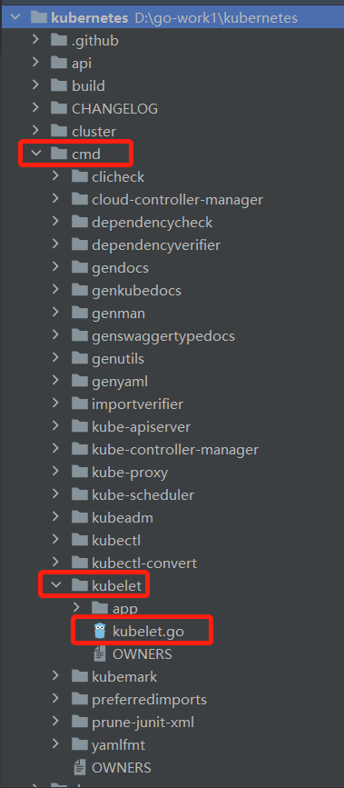
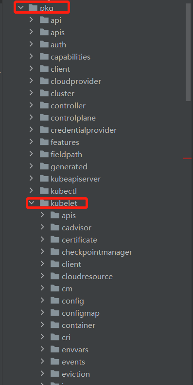

# Kubelet 
## **概要**: 

kubelet 是运行在每个节点上的主要的“节点代理”，每个节点都会启动 kubelet进程，用来处理 Master 节点下发到本节点的任务，
按照 PodSpec 描述来管理Pod 和其中的容器（PodSpec 是用来描述一个 pod 的 YAML 或者 JSON 对象）。
kubelet 通过各种机制（主要通过 apiserver ）获取一组 PodSpec 并保证在这些 PodSpec 中描述的容器健康运行。
## Kubenetes version: 

## 源码:
- `cmd/kubelet/kubectl.go`    // cmd/kubelet/kubectl.go 为 main 函数入口，主要负责参数加载，运行框架等前期准备工作

- `pkg/kubelet/kubectl.go`    // pkg/kubelet/kubectl.go 主要负责功能上的逻辑代码

### 目录结构: 



### cmd/kubelet/kubectl.go 源码分析:

1. kubelet 程序主入口, 使用了 corbra 命令行框架处理启动命令,它从命令行的RunE回调函数-->Run函数，开始执行启动流程。

   //  cobra使用问题请移步: https://github.com/chenghongxi/go-learning/tree/main/cobra

    代码: https://github.com/kubernetes/kubernetes/blob/master/cmd/kubelet/kubelet.go#L34
```text
func main() {
	command := app.NewKubeletCommand()
	code := cli.Run(command)
	os.Exit(code)
}
```

2. 
```text
NewKubeletCommand函数主要作用，从命令行的RunE回调函数-->Run函数，开始启动流程流程,从下面的代码中可以看到,NewKubeletCommand 函数是做前期的工作准备，
比如：参数解析，校验，构建依赖，构建server,通过这些参数运行Kubelet,进入Run函数:
```
    
代码: https://github.com/kubernetes/kubernetes/blob/cf12a74b18b66efc577ec819c78a0c68f6d49225/cmd/kubelet/app/server.go#L124
```text
func NewKubeletCommand() *cobra.Command {
	cleanFlagSet := pflag.NewFlagSet(componentKubelet, pflag.ContinueOnError)
	cleanFlagSet.SetNormalizeFunc(cliflag.WordSepNormalizeFunc)
	kubeletFlags := options.NewKubeletFlags()

	kubeletConfig, err := options.NewKubeletConfiguration()
	// 错误
	if err != nil {
		klog.ErrorS(err, "Failed to create a new kubelet configuration")
		os.Exit(1)
	}

	cmd := &cobra.Command{
		Use: componentKubelet,
		Long: `The kubelet is the primary "node agent" that runs on each
node. It can register the node with the apiserver using one of: the hostname; a flag to
override the hostname; or specific logic for a cloud provider.
The kubelet works in terms of a PodSpec. A PodSpec is a YAML or JSON object
that describes a pod. The kubelet takes a set of PodSpecs that are provided through
various mechanisms (primarily through the apiserver) and ensures that the containers
described in those PodSpecs are running and healthy. The kubelet doesn't manage
containers which were not created by Kubernetes.
Other than from an PodSpec from the apiserver, there are two ways that a container
manifest can be provided to the Kubelet.
File: Path passed as a flag on the command line. Files under this path will be monitored
periodically for updates. The monitoring period is 20s by default and is configurable
via a flag.
HTTP endpoint: HTTP endpoint passed as a parameter on the command line. This endpoint
is checked every 20 seconds (also configurable with a flag).`,
		DisableFlagParsing: true,
		SilenceUsage:       true,
		RunE: func(cmd *cobra.Command, args []string) error {
			// initial flag parse, since we disable cobra's flag parsing
			if err := cleanFlagSet.Parse(args); err != nil {
				return fmt.Errorf("failed to parse kubelet flag: %w", err)
			}


			// 检查是否有命令未传入参数，若是，则返回错误和使用指引
			cmds := cleanFlagSet.Args()
			if len(cmds) > 0 {
				return fmt.Errorf("unknown command %+s", cmds[0])
			}

			// short-circuit on help
			// 检查是否设置了帮助指引
			help, err := cleanFlagSet.GetBool("help")
			if err != nil {
				return errors.New(`"help" flag is non-bool, programmer error, please correct`)
			}
			if help {
				return cmd.Help()
			}


			// 若是查看版本信息，则返回版本信息及退出
			verflag.PrintAndExitIfRequested()

			// set feature gates from initial flags-based config
			if err := utilfeature.DefaultMutableFeatureGate.SetFromMap(kubeletConfig.FeatureGates); err != nil {
				return fmt.Errorf("failed to set feature gates from initial flags-based config: %w", err)
			}


			// 校验kubelet flag相关参数传入是否合法，如果合法则初始化到对应变量
			if err := options.ValidateKubeletFlags(kubeletFlags); err != nil {
				return fmt.Errorf("failed to validate kubelet flags: %w", err)
			}

			if cleanFlagSet.Changed("pod-infra-container-image") {
				klog.InfoS("--pod-infra-container-image will not be pruned by the image garbage collector in kubelet and should also be set in the remote runtime")
			}

	
			// 检测并解析kubelet配置文件
			if configFile := kubeletFlags.KubeletConfigFile; len(configFile) > 0 {
				kubeletConfig, err = loadConfigFile(configFile)
				if err != nil {
					return fmt.Errorf("failed to load kubelet config file, error: %w, path: %s", err, configFile)
				}

				if err := kubeletConfigFlagPrecedence(kubeletConfig, args); err != nil {
					return fmt.Errorf("failed to precedence kubeletConfigFlag: %w", err)
				}

				if err := utilfeature.DefaultMutableFeatureGate.SetFromMap(kubeletConfig.FeatureGates); err != nil {
					return fmt.Errorf("failed to set feature gates from initial flags-based config: %w", err)
				}
			}

			// 初始化日志
			logs.InitLogs()
			if err := logsapi.ValidateAndApplyAsField(&kubeletConfig.Logging, utilfeature.DefaultFeatureGate, field.NewPath("logging")); err != nil {
				return fmt.Errorf("initialize logging: %v", err)
			}
			//若是查看参数使用，则输出所有参数说明
			cliflag.PrintFlags(cleanFlagSet)

			// 本地命令行+配置文件验证
			if err := kubeletconfigvalidation.ValidateKubeletConfiguration(kubeletConfig, utilfeature.DefaultFeatureGate); err != nil {
				return fmt.Errorf("failed to validate kubelet configuration, error: %w, path: %s", err, kubeletConfig)
			}

			if (kubeletConfig.KubeletCgroups != "" && kubeletConfig.KubeReservedCgroup != "") && (strings.Index(kubeletConfig.KubeletCgroups, kubeletConfig.KubeReservedCgroup) != 0) {
				klog.InfoS("unsupported configuration:KubeletCgroups is not within KubeReservedCgroup")
			}

			// construct a KubeletServer from kubeletFlags and kubeletConfig
			kubeletServer := &options.KubeletServer{
				KubeletFlags:         *kubeletFlags,
				KubeletConfiguration: *kubeletConfig,
			}


			// 通过kubelet server和DefaultFeatureGate，构建kubeletDeps，
			// kubeletDeps主要集成了kubelet的运行依赖如：认证信息、第三方云厂商信息、事件记录、挂载、网络/卷插件、OOM管理等依赖组件调用链操作句柄
			kubeletDeps, err := UnsecuredDependencies(kubeletServer, utilfeature.DefaultFeatureGate)
			if err != nil {
				return fmt.Errorf("failed to construct kubelet dependencies: %w", err)
			}

			if err := checkPermissions(); err != nil {
				klog.ErrorS(err, "kubelet running with insufficient permissions")
			}

			config := kubeletServer.KubeletConfiguration.DeepCopy()
			for k := range config.StaticPodURLHeader {
				config.StaticPodURLHeader[k] = []string{"<masked>"}
			}
			// log the kubelet's config for inspection
			klog.V(5).InfoS("KubeletConfiguration", "configuration", config)

			// 设置kubelet关闭的信号环境
			ctx := genericapiserver.SetupSignalContext()

			utilfeature.DefaultMutableFeatureGate.AddMetrics()
			
			// 启动kubelet，把ctx、kubeletServer、kubeletDeps、utilfeature.DefaultFeatureGate这些准备好的参数传入，
			// 执行内层核心Run函数
			return Run(ctx, kubeletServer, kubeletDeps, utilfeature.DefaultFeatureGate)
		},
	}

	kubeletFlags.AddFlags(cleanFlagSet)
	options.AddKubeletConfigFlags(cleanFlagSet, kubeletConfig)
	options.AddGlobalFlags(cleanFlagSet)
	cleanFlagSet.BoolP("help", "h", false, fmt.Sprintf("help for %s", cmd.Name()))

	const usageFmt = "Usage:\n  %s\n\nFlags:\n%s"
	cmd.SetUsageFunc(func(cmd *cobra.Command) error {
		fmt.Fprintf(cmd.OutOrStderr(), usageFmt, cmd.UseLine(), cleanFlagSet.FlagUsagesWrapped(2))
		return nil
	})
	cmd.SetHelpFunc(func(cmd *cobra.Command, args []string) {
		fmt.Fprintf(cmd.OutOrStdout(), "%s\n\n"+usageFmt, cmd.Long, cmd.UseLine(), cleanFlagSet.FlagUsagesWrapped(2))
	})

	return cmd
}
```

3. 


  
