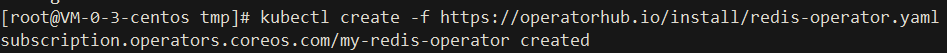

# Operator Lifecycle Manager(OLM)

- `Website: https://docs.openshift.com/container-platform/3.11/install_config/installing-operator-framework.html`
- `GitHub: https://github.com/operator-framework/operator-lifecycle-manager.git`
- `community-operators-prod: https://github.com/redhat-openshift-ecosystem/community-operators-prod/tree/main/operators`

## Prerequisites
- `Kubernetes v1.11.3+ cluster`
- `kubectl v1.11.3+`

## 组件介绍:
```text
OLM(Operator Lifecycle Manager) 作为 Operator Framework 的一部分，可以帮助用户进行 Operator 的自动安装，
升级及其生命周期的管理。同时 OLM 自身也是以 Operator 的形式进行安装部署，可以说它的工作方式是以 Operators 来管理 Operators，
而它面向 Operator 提供了声明式 (declarative) 的自动化管理能力也完全符合 Kubernetes 交互的设计理念。
```

## 组件原理:
```text
OLM 由两个 Operator 构成：OLM Operator 和 Catalog Operator，其分别管理以下几个基础 CRD 模型：
```


## 使用场景:
OLM可以帮助用户，安装，更新，和管理所有Operator的生命周期

### Install:
- `Scripted`
```text
curl -sL https://github.com/operator-framework/operator-lifecycle-manager/releases/download/v0.19.1/install.sh | bash -s v0.19.1
```


- `Operator-sdk`

请查看官方快速开始文档
```text
https://olm.operatorframework.io/docs/getting-started/
```

#### Validation:
```text
kubectl get ns
```

```text
kubectl -n olm get deployments
```


## Example

### redis-operators

#### Install:
```text
kubectl create -f https://operatorhub.io/install/redis-operator.yaml
```

```text
kubectl get csv -n operators
```

