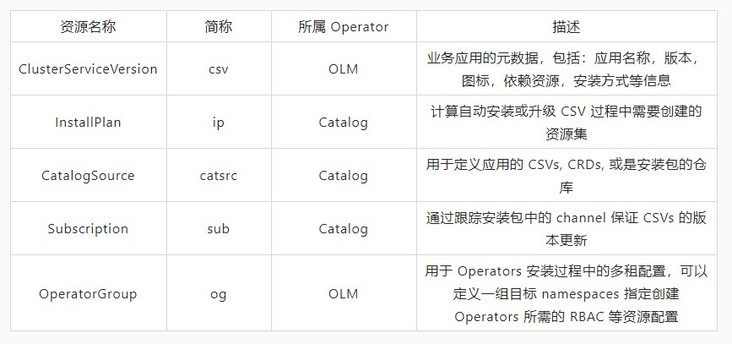
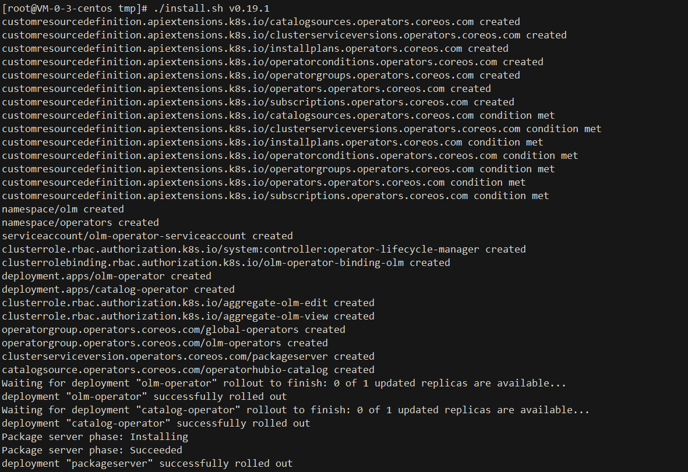
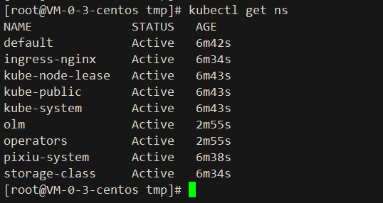

# Operator Lifecycle Manager ( OLM ) 

- `Website`: https://access.redhat.com/documentation/zh-cn/openshift_container_platform/4.11/html/operators/_operator-lifecycle-manager-olm
- `GitHub`: https://github.com/operator-framework/operator-lifecycle-manager.git
- `Operatorhub`: https://operatorhub.io/

## Rely on
- `kubectl v1.11.3+`
- `Kubernetes v1.11.3+ cluster`

## Environment version
1. 机器配置：4核，8G
2. Kubernetes Version: v1.23.6
3. 集群安装方法: https://github.com/caoyingjunz/kubez-ansible
## 组件介绍:
```text
OLM( Operator Lifecycle Manager ) 作为 Operator Framework 的一部分，可以帮助用户进行 Operator 的自动安装，
升级及其生命周期的管理。同时 OLM 自身也是以 Operator 的形式进行安装部署，可以说它的工作方式是以 Operators 来管理 Operators，
而它面向 Operator 提供了声明式 ( declarative ) 的自动化管理能力也完全符合 Kubernetes 交互的设计理念。
```

## 组件原理:
```text
OLM 由两个 Operator 构成：OLM Operator 和 Catalog Operator

OLM Operator: 负责部署由 CSV 资源定义的应用程序。

Catalog Operator: 负责解析和安装集群服务版本 ( CSV ) 以及它们指定的所需资源。另外还负责监视频道中的目录源中是否有软件包更新，并将其升级（可选择自动）至最新可用版本。

两个Operator其分别管理以下几个基础 CRD 模型：
```



## 使用场景:
OLM 可以帮助用户，安装，更新，和管理所有Operator ( 如: redis-operator , mongodb-operator ) 的生命周期.


### Install:
- `Scripted`
```shell
curl -L https://github.com/operator-framework/operator-lifecycle-manager/releases/download/v0.19.1/install.sh -o install.sh
chmod +x install.sh
./install.sh v0.19.1
```



##### `安装过程解析`

[crds.yaml](yml/crds.yaml)

[olm.yml](yml/olm.yaml)

- `Operator-sdk`

请查看官方快速开始文档
```text
https://olm.operatorframework.io/docs/getting-started/
```

#### Validation:
```text
kubectl get ns
```

```text
kubectl -n olm get deployments
```


## UnInstall
```shell
1. kubectl delete -f olm.yaml
2. kubectl delete -f crds.yaml
```

## Operators

## 什么是Operators:
```text
简单来说，Operators 就是一组自定义控制器的集合以及由这些控制器管理着的一系列自定义资源，我们将不在关注于 pod，configmap 等基本模型元素，
而是将他们聚合为一个应用或服务，Operator 通过控制器的协调循环来使自定义应用达到我们期望的状态，我们只需要关注该应用的期望状态，通过自定义控制器协调循环逻辑，
来达到安装，更新，扩展，备份，恢复 7*24 小时不间断的应用或服务的生命周期管理。
```
## Operators对象:
```
CRD:自定义资源的定义，Kubernetes API 服务器会为你所指定的每一个 CRD 版本生成 RESTful 的资源路径。一个 CRD 其实就是定义自己应用业务模型的地方，
可以根据业务的需求，完全定制自己所需要的资源对象，如 RedisCluster, PrometheusServer 等这些都是可以被 Kubernetes 直接操作和管理的自定义的资源对象。

CR：自定义资源，即 CRD 的一个具体实例，是具体的可管理的 Kubernetes 资源对象，可以对其进行正常的生命周期管理，如创建，删除，修改，查询等，
同时 CR 对象一般还会包含运行时的状态，如当前的 CR 的真实的状态是什么，用于观察和判断，CR 对象的真正所处于的状态。

Controller：其实就是控制器真正的用武之地了，它会循环处理工作队列中的动作，按照逻辑协调应用当前状态至期望状态。如观察一个 CR 对象被创建了之后，
会根据实现的逻辑来处理 CR，让 CR 对象的状态以及CR对象所负责的业务逻辑慢慢的往最终期望的状态上靠近，最终达到期望的效果，举例来说如果定义了一个 RocketMQ 的 Operator，
那在创建 RocketMQCluster 的时候，就会一直协调和观察 RocketMQ 真正的集群是不是创建好了，以及每个节点的状态和可用性是不是健康的，
一旦发现不符合期望的状态就会继续协调，就一直保持基于事件的机制，不断检查和协调，去保证期望的状态。
```

## Application

[Redis-Operators](redis-operators/README.md)

[MongoDB-Operators](mongodb-operators/README.md)

[Rabbitmq-Operators](rabbitmq-operators/README.md)

[Postgres-Operators](postgres-Operators/README.md)

