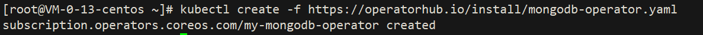
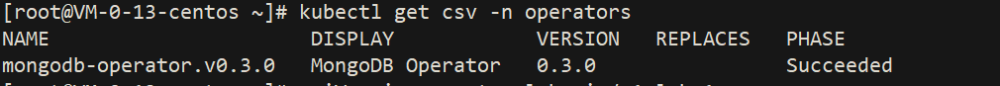
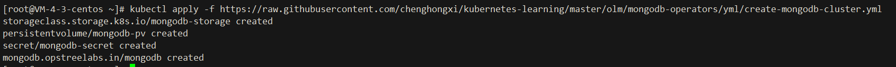
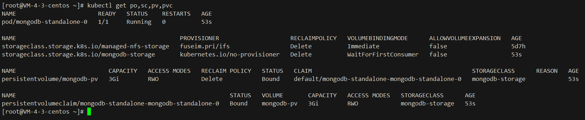
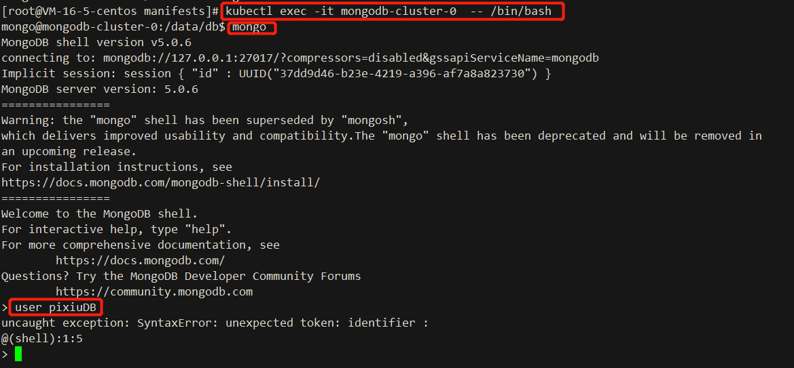

# Mongodb-Operators

基于 golang 的操作员，用于创建和管理 MongoDB standalone or cluster

MongoDB Operator  用于在 Kubernetes 和 Openshift 集群上创建、更新和管理 MongoDB standalone, replicated, and arbiter replicated。


## Documentation
https://ot-mongodb-operator.netlify.app/

## Rely on
- `Kubernetes 1.17.0 cluster`
 
## Install:
```text
1. kubectl apply -f https://operatorhub.io/install/mongodb-operator.yaml
```


[mongodb-operator.yml](https://operatorhub.io/install/mongodb-operator.yaml)

```shell
2. kubectl get csv -n operators
```



```shell
3. kubectl apply -f https://raw.githubusercontent.com/chenghongxi/kubernetes-learning/master/olm/mongodb-operators/yml/create-mongodb-cluster.yml
```



[create-mongodb-cluster](https://raw.githubusercontent.com/chenghongxi/kubernetes-learning/master/olm/mongodb-operators/yml/create-mongodb-cluster.yml)


## Validation
```shell
1. kubectl get po,sc,pv,pvc
```

```shell
1. kubectl exec -it mongodb-standalone-0 -- /bin/bash
2. mongo
3. use pixiuDB
```



## UnInstall
- `删除步骤 3 中的资源`
```shell
kubectl delete -f https://raw.githubusercontent.com/chenghongxi/kubernetes-learning/master/olm/mongodb-operators/yml/create-mongodb-cluster.yml
```
- `删除此 Operator`
```shell
1. kubectl delete subscription <subscription-name> -n operators
2. kubectl delete clusterserviceversion -n operators
```
