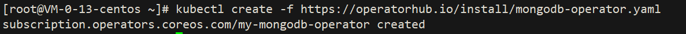
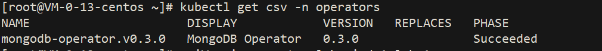
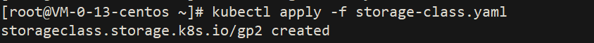
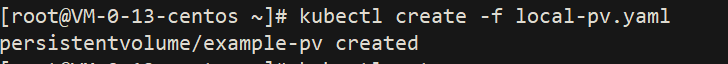
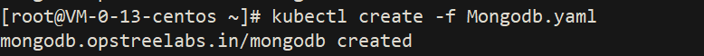
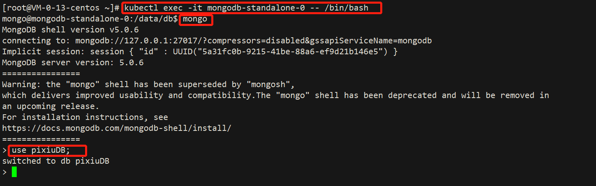

# Mongodb-Operators

基于 golang 的操作员，用于创建和管理 MongoDB standalone or cluster

MongoDB Operator  用于在 Kubernetes 和 Openshift 集群上创建、更新和管理 MongoDB standalone, replicated, and arbiter replicated。


## Documentation
https://ot-mongodb-operator.netlify.app/

## Rely on
- `Kubernetes 1.17.0 cluster`
 
## Install:
```text
1. kubectl create -f https://operatorhub.io/install/mongodb-operator.yaml
```


[mongodb-operator](yml/mongodb-operator.yaml)

```shell
2. kubectl get csv -n operators
```



```shell
3. kubectl apply -f https://raw.githubusercontent.com/chenghongxi/kubernetes-learning/master/olm/mongodb-operators/yml/create-mongodb-cluster.yaml
```



[storage-class.yml](yml/storage-class.yaml)

```shell
4. kubectl create -f local-pv.yml
```



[local-pv.yml](yml/local-pv.yaml)


```shell
5. kubectl create -f mongodb-secret.yml 
```


[mongodb-secret.yml](yml/mongodb-secret.yml)


```shell
6. kubectl create -f Mongodb.yaml
```



[Mongodb.yaml](yml/Mongodb.yaml)

## Validation

```shell
1. kubectl exec -it mongodb-standalone-0 -- /bin/bash
2. mongo
3. use pixiuDB
```


## UnInstall
```shell
1. kubectl delete -f Mongodb.yaml
2. kubectl delete -f mongodb-secret.yml
3. kubectl delete -f local-pv.yaml
4. kubectl delete -f storage-class.yaml
5. kubectl delete -f mongodb-operator.yaml
```

