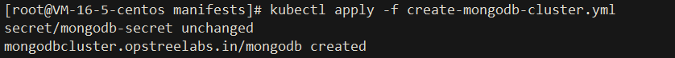
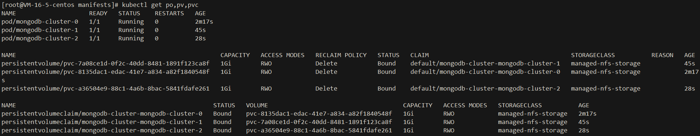

# Mongodb-Operators

基于 golang 的操作员，用于创建和管理 MongoDB standalone or cluster

MongoDB Operator  用于在 Kubernetes 和 Openshift 集群上创建、更新和管理 MongoDB standalone, replicated, and arbiter replicated。


## Documentation
https://ot-mongodb-operator.netlify.app/

## Rely on
- `Kubernetes 1.17.0 cluster`
- 集群已安装 `OLM` 组件。安装手册参考 [OLM安装](../README.md)
 
## Install:
```text
1. kubectl apply -f https://operatorhub.io/install/mongodb-operator.yaml
```


#### `安装过程解析`
- 原理同 `redis-operator`

- [redis-operator](https://github.com/chenghongxi/kubernetes-learning/blob/master/olm/redis-operators/README.md#%E5%AE%89%E8%A3%85%E8%BF%87%E7%A8%8B%E8%A7%A3%E6%9E%90)


```shell
2. kubectl get csv -n operators
```


```shell
3. kubectl apply -f https://raw.githubusercontent.com/chenghongxi/kubernetes-learning/master/olm/mongodb-operators/yml/create-mongodb-cluster.yml
```




[create-mongodb-cluster](https://raw.githubusercontent.com/chenghongxi/kubernetes-learning/master/olm/mongodb-operators/yml/create-mongodb-cluster.yml)


## Validation
```shell
1. kubectl get po,sc,pv,pvc
```

```shell
1. kubectl exec -it mongodb-cluster-0  -- /bin/bash
2. mongo
3. use pixiuDB
```


## UnInstall
- `删除步骤 3 中的资源`
```shell
kubectl delete -f https://raw.githubusercontent.com/chenghongxi/kubernetes-learning/master/olm/mongodb-operators/yml/create-mongodb-cluster.yml
```
- `删除此 Operator`
```shell
1. kubectl delete subscription <subscription-name> -n operators
2. kubectl delete clusterserviceversion -n operators
```
