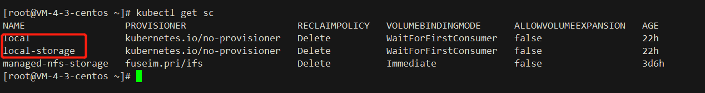
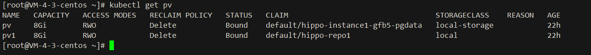
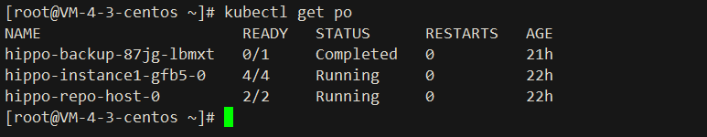

# Postgres-Operator

## Documentation
https://access.crunchydata.com/documentation/postgres-operator/v5/

## Github
https://github.com/CrunchyData/postgres-operator

## Rely On
- `Kubernetes Cluster Version > 1.19.0`

## Install:

```shell
1. kubectl create -f https://operatorhub.io/install/postgresql.yaml
```


[postgres-operator.yaml](yml/postgres-operator.yaml)

```shell
2. kubectl get csv -n operators
```


```shell
3. kubectl create -f sc.yml
4. kubectl create -f sc1.yml
```


[sc.yml](yml/sc.yml)

[sc1.yml](yml/sc1.yml)

```shell
5. kubectl create -f local-pv.yml
6. kubectl create -f local-pv1.yml
```


[local-pv.yml](yml/local-pv.yml)

[local-pv1.yml](yml/local-pv1.yml)

```shell
7. kubectl create -f Postgres-cluster.yml
```


[Postgres-cluster.yml](yml/Postgres-cluster.yml)

## Validation


