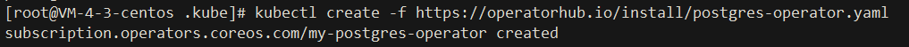
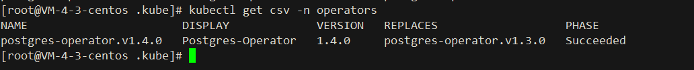

# Postgres-Operator

## Documentation
https://access.crunchydata.com/documentation/postgres-operator/v5/

## Github
https://github.com/CrunchyData/postgres-operator

## Rely On
- `Kubernetes Cluster Version > 1.19.0`

## Install:

```shell
1. kubectl create -f https://operatorhub.io/install/postgresql.yaml
```


[postgres-operator.yaml](yml/postgres-operator.yaml)

```shell
1. kubectl get csv -n operators
```



