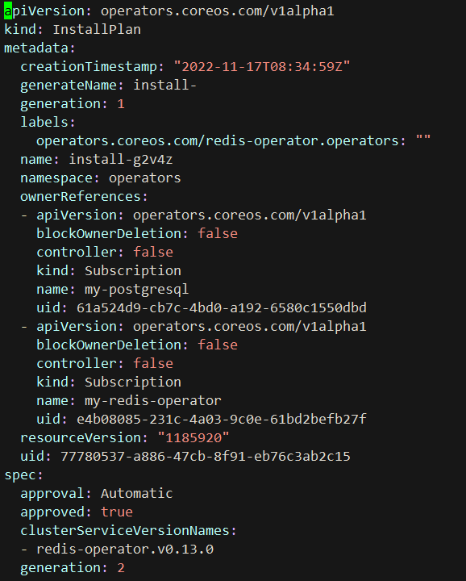
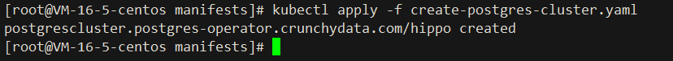

# Postgres-Operator

## Documentation
https://access.crunchydata.com/documentation/postgres-operator/v5/

## Github
https://github.com/CrunchyData/postgres-operator

## Supported Features
- `集群配置: `
- `高可用性`
- `灾难恢复`
- `监控`
- `克隆`
- `TLS`
- `连接池`
- `亲和力和容忍度`
- `完全的可定制性`

## Rely On
- `Kubernetes Cluster Version > 1.19.0`

## Install:

```shell
1. kubectl apply -f https://operatorhub.io/install/postgresql.yaml
```


#### `安装过程解析`
- 创建 `Subscription` 对象
  
    - `Subscription` 对象从 `Catalog source` 获取可用版本
    - `metadaata.generation` 初始值为1:  随着 `spec` 内容的改变而自增
    - `spec.image` 此镜像用于, 实例化一个 `registry-serve`
    - `spec.publisher` 发行商
    - `spec.sourceType` 源类型
     
- `Subscription`会创建一个 `Install` 对象为 `Operator` 安装资源,根据批准策略来批准安装计划:
    - `如果 Subscription 的 spec.approval 字段被设置为 Automatic，则会自动批准安装计划。`
    - `如果 Subscription 的 spec.approval 字段被设置为 Manual，则安装计划必须由集群管理员或具有适当权限的用户手动批准。`
        - `批准安装计划后，OLM 会创建指定的资源，并在 Subscription 指定的命名空间中安装 Operator。`
        


- [redis-operator](https://github.com/chenghongxi/kubernetes-learning/blob/master/olm/redis-operators/README.md#%E5%AE%89%E8%A3%85%E8%BF%87%E7%A8%8B%E8%A7%A3%E6%9E%90)


```shell
2. kubectl get csv -n operators
```


```shell
3. kubectl apply -f https://raw.githubusercontent.com/chenghongxi/kubernetes-learning/master/olm/postgres-Operators/yml/create-postgres-cluster.yaml
```


[create-postgres-cluster.yaml](https://raw.githubusercontent.com/chenghongxi/kubernetes-learning/master/olm/postgres-Operators/yml/create-postgres-cluster.yaml)


## Validation
```shell
1. kubectl get sts,sc,pv,secret
```
`hippo-instance1-gfb5-0` `pod` 中会创建几个容器，分别为:  `database`, `replication-cert-copy`, `pgbackrest`, `pgbackrest-config`,`postgres-startup (init)`, `nss-wrapper-init (init)`

`hippo-repo-host-0` `pod` 中会创建几个容器，分别为:`pgbackrest`, `pgbackrest-config`, `pgbackrest-log-dir (init)`, `nss-wrapper-init (init)`


```text
1. kubectl exec -it hippo-instance1-gfb5-0 -- /bin/bash
2. psql
```


## UnInstall
- `删除步骤 3 中的资源`
```shell
kubectl delete -f https://raw.githubusercontent.com/chenghongxi/kubernetes-learning/master/olm/postgres-Operators/yml/create-postgres-cluster.yaml
```
- `删除此 Operator`
```shell
1. kubectl delete subscription <subscription-name> -n operators
2. kubectl delete clusterserviceversion -n operators
```


