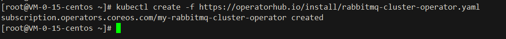
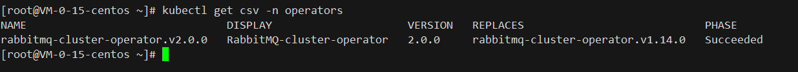
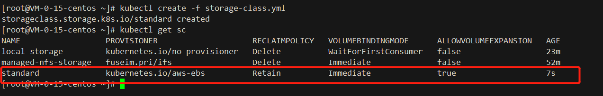
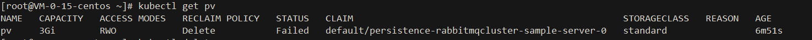
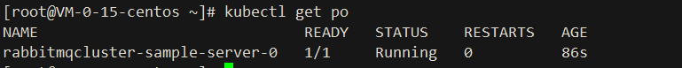

# rabbitmq-operators

## Documentation
https://www.rabbitmq.com/kubernetes/operator/operator-overview.html

## Rely on
- `Kubernetes 1.19.0 cluster`

## Install:


```shell
1. kubectl create -f https://operatorhub.io/install/rabbitmq-cluster-operator.yaml
```



[rabbitmq-cluster-operator.yaml](yml/rabbitmq-cluster-operator.yaml)

```shell
2. kubectl get csv -n operators
```


```shell
3. kubectl create -f https://raw.githubusercontent.com/chenghongxi/kubernetes-learning/master/olm/rabbitmq-operators/yml/create-rabbitmq-cluster.yaml
```


[storage-class.yml](yml/storage-class.yml)

```shell
4. kubectl create -f local-pv.yml
```



[local-pv.yml](yml/local-pv.yaml)

```shell
5. kubectl create -f rabbitmq.yaml
```


[rabbitmq.yaml](yml/rabbitmq.yaml)

## UnInstall
```shell
1. kubectl delete -f https://raw.githubusercontent.com/chenghongxi/kubernetes-learning/master/olm/rabbitmq-operators/yml/create-rabbitmq-cluster.yaml
2. kubectl delete csv redis-operator.v0.13.0
```
