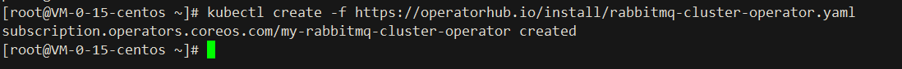
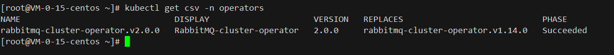
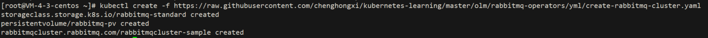
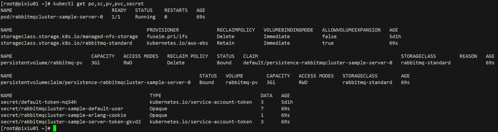

# Rabbitmq-Operators

部署和管理RabbitMQ集群。为 RabbitMQ 集群的生命周期（创建、升级、正常关闭）设计的自定义控制器和自定义资源定义 ( CRD )

## Documentation
https://www.rabbitmq.com/kubernetes/operator/operator-overview.html

## GitHub
https://github.com/rabbitmq/cluster-operator

## Rely on
- `Kubernetes 1.19.0 cluster`

## Install:


```shell
1. kubectl create -f https://operatorhub.io/install/rabbitmq-cluster-operator.yaml
```



[rabbitmq-cluster-operator.yaml](yml/rabbitmq-cluster-operator.yaml)

```shell
2. kubectl get csv -n operators
```


```shell
3. kubectl create -f https://raw.githubusercontent.com/chenghongxi/kubernetes-learning/master/olm/rabbitmq-operators/yml/create-rabbitmq-cluster.yaml
```


[create-rabbitmq-cluster.yaml](https://raw.githubusercontent.com/chenghongxi/kubernetes-learning/master/olm/rabbitmq-operators/yml/create-rabbitmq-cluster.yaml)

## Validation
```shell
1. kubectl get po,sc,pv,pvc,secret
```

## UnInstall
- `删除步骤 3 中的资源`
```shell
kubectl delete -f https://raw.githubusercontent.com/chenghongxi/kubernetes-learning/master/olm/rabbitmq-operators/yml/create-rabbitmq-cluster.yaml
```
- `删除此 Operator`
```shell
1. kubectl delete subscription <subscription-name> -n <namespace>
2. kubectl delete clusterserviceversion -n <namespace>
```