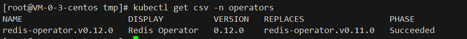
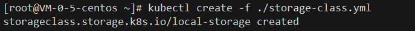
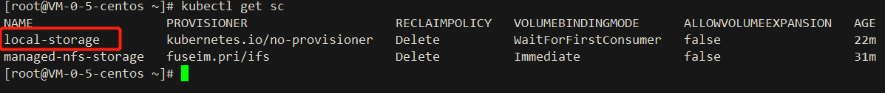
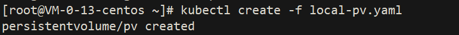
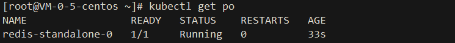

# redis-operators

## Supported redis versions:

- `=> v6`
- `=> v7`

## Documentation
https://ot-container-kit.github.io/redis-operator/

## Rely on
- `Kubernetes 1.18.0 cluster`

## Install:


```shell
1. kubectl create -f https://operatorhub.io/install/redis-operator.yaml
```


[redis-operator.yaml](yml/redis-operator.yaml)

```shell
2. kubectl get csv -n operators
```


```shell
3. kubectl apply -f https://raw.githubusercontent.com/chenghongxi/kubernetes-learning/master/olm/redis-operators/yml/create-redis-cluster.yaml
```




[storage-class.yml](yml/storage-class.yml)

```shell
4. kubectl create -f local-pv.yml
```



[local-pv.yml](yml/local-pv.yaml)


```shell
5. kubectl create -f redis-single.yml
```


[redis-single](yml/redis-single.yml)

## Validation
```text
1. kubectl exec -it redis-standalone-0 -- /bin/bash
2. redis-cli -c
3. set k1 v1
4. get k1
```


## UnInstall
```shell
1. kubectl delete -f redis-single.yml
2. kubectl delete -f local-pv.yml
3. kubectl delete -f storage-class.yml
4. kubectl delete -f redis-operator.yaml
```


