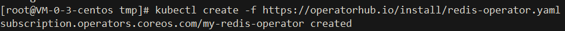
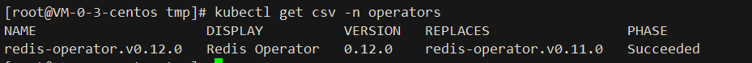
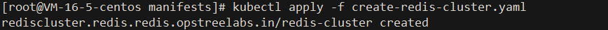
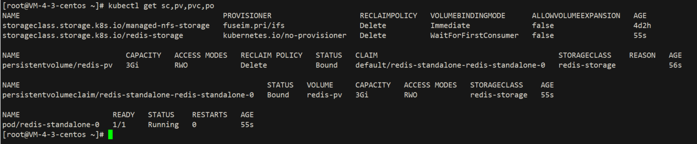
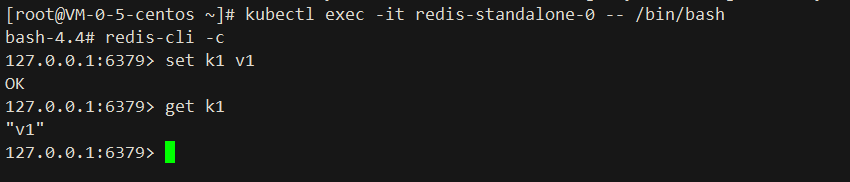

# Redis-operators
基于 `Golang` 的 Redos-Operator,可以在 `Kubernetes` 集群上创建 `Redis standalone/cluster` 模式。使用 `Redis-Exporter` 提供监控功能。

## Supported redis versions:
- `=> v6`

## Documentation
https://ot-container-kit.github.io/redis-operator/

## GitHub
https://github.com/ot-container-kit/redis-operator

## Rely on
- `Kubernetes 1.18.0 cluster`

## Install:


```shell
1. kubectl create -f https://operatorhub.io/install/redis-operator.yaml
```



[redis-operator.yaml](https://operatorhub.io/install/redis-operator.yaml)

```shell
2. kubectl get csv -n operators
```


```shell
3. kubectl apply -f https://raw.githubusercontent.com/chenghongxi/kubernetes-learning/master/olm/redis-operators/yml/create-redis-cluster.yaml
```



[create-redis-cluster.yaml](https://raw.githubusercontent.com/chenghongxi/kubernetes-learning/master/olm/redis-operators/yml/create-redis-cluster.yaml)


## Validation
```shell
1. kubectl get sc,pv,pvc,po
```

```text
2. kubectl exec -it redis-standalone-0 -- /bin/bash
3. redis-cli -c
4. set k1 v1
5. get k1
```


## UnInstall
- `删除步骤 3 中的资源`
```shell
kubectl delete -f https://raw.githubusercontent.com/chenghongxi/kubernetes-learning/master/olm/redis-operators/yml/create-redis-cluster.yaml
```
- `删除此 Operator`
```shell
1. kubectl delete subscription <subscription-name> -n <namespace>
2. kubectl delete clusterserviceversion -n <namespace>
```


